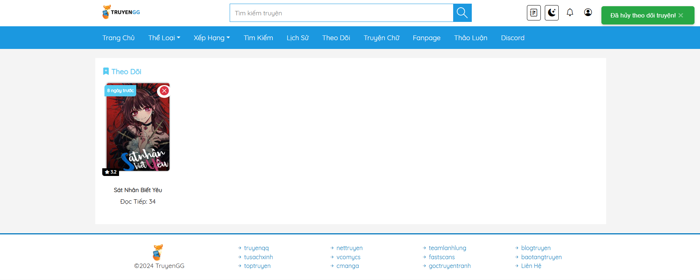
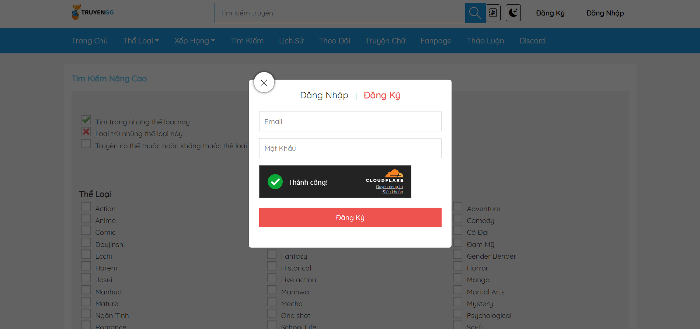

# TruyenGG - Nền tảng đọc truyện trực tuyến

Chào mừng bạn đến với **TruyenGG**, một ứng dụng web đọc truyện mạnh mẽ với giao diện thân thiện, hỗ trợ chế độ sáng/tối và tích hợp các tính năng quản lý nội dung, người dùng. Được lấy cảm hứng từ [truyengg.com](https://truyengg.com/), TruyenGG mang đến trải nghiệm đọc truyện mượt mà với khả năng tích hợp API bên ngoài để lấy nội dung và lưu trữ hình ảnh.

## Tính năng

- **Hiển thị truyện**: Lấy dữ liệu truyện từ [OTruyen API](https://otruyenapi.com/) và hiển thị hình ảnh từ [ImgBB](https://imgbb.com/).
- **Tương tác người dùng**: Thích, theo dõi truyện, lưu lịch sử đọc và bình luận chương.
- **Xác thực người dùng**: Đăng ký, đăng nhập, khôi phục mật khẩu và đăng nhập bằng Google.
- **Quản lý nội dung**: Tự động crawl truyện từ [TruyenQQ](https://truyenqq.com/) hoặc thêm, sửa, xóa truyện và chương thủ công.
- **Quản lý người dùng**: Bảng quản trị cho phép quản lý tài khoản, phân quyền (admin, user, nhóm dịch).
- **Giao diện**: Hỗ trợ chế độ sáng/tối, thiết kế tương tự ~90% [truyengg.com](https://truyengg.com/).
- **Tính năng nâng cao**: Tìm kiếm theo thể loại, xem top truyện tháng, quản lý thông tin cá nhân.

## Ảnh Demo

Dưới đây là các ảnh chụp giao diện của TruyenGG, sắp xếp từ trang người dùng đến trang quản trị:

1. **Trang chủ**  
     
   Giao diện chính với bố cục trực quan để khám phá truyện.

2. **Thông tin truyện**  
     
   Xem chi tiết truyện, bao gồm tóm tắt, thể loại và danh sách chương.

3. **Trang đọc truyện**  
     
   Trải nghiệm đọc truyện mượt mà với điều hướng chương.

4. **Lọc theo thể loại**  
     
   Duyệt truyện theo thể loại để dễ dàng tìm kiếm.

5. **Tìm kiếm nâng cao**  
     
   Tìm kiếm truyện theo nhiều tiêu chí.

6. **Truyện mới cập nhật**  
     
   Cập nhật danh sách truyện mới nhất.

7. **Top truyện tháng**  
     
   Khám phá các truyện nổi bật theo tháng.

8. **Lịch sử đọc**  
     
   Theo dõi tiến độ đọc truyện.

9. **Danh sách theo dõi**  
     
   Quản lý danh sách truyện đang theo dõi.

10. **Thông tin tài khoản**  
      
    Xem và chỉnh sửa thông tin cá nhân.

11. **Đăng ký**  
      
    Form đăng ký tài khoản đơn giản và an toàn.

12. **Đăng nhập**  
      
    Trang đăng nhập hỗ trợ Google OAuth.

13. **Bảng quản trị**  
      
    Trang tổng quan dành cho quản trị viên.

14. **Quản lý truyện**  
      
    Thêm, sửa, xóa truyện và chương.

15. **Quản lý người dùng**  
      
    Quản lý tài khoản và phân quyền.

16. **Công cụ crawl**  
      
    Công cụ tự động crawl truyện từ TruyenQQ.

## Hướng dẫn cài đặt

### Yêu cầu
- **Môi trường local**: Cài đặt [Laragon](https://laragon.org/) hoặc [XAMPP](https://www.apachefriends.org/).
- **PHP**: Phiên bản 7.4 trở lên.
- **MySQL**: Quản lý cơ sở dữ liệu.
- **Composer**: Quản lý thư viện (nếu dùng Laravel).
- **Trình duyệt**: Chrome, Firefox hoặc bất kỳ trình duyệt hiện đại nào.

### Cấu hình

1. **Cấu hình cơ sở dữ liệu**  
   Chỉnh sửa thông tin kết nối trong file `config/database.php`:  
   ```php
   $servername = "localhost";      // Tên host cơ sở dữ liệu
   $username = "root";            // Tên người dùng cơ sở dữ liệu
   $password = "";                // Mật khẩu cơ sở dữ liệu
   $dbname = "hoangtoph";         // Tên cơ sở dữ liệu
   ```
   Cập nhật các giá trị phù hợp với cấu hình MySQL của bạn.

2. **Cấu hình gửi email khôi phục mật khẩu**  
   Sửa thông tin email trong file `config/send_email.php` (dòng 68-69):  
   ```php
   $mail->Username = 'tophvn17@gmail.com'; // Email của bạn
   $mail->Password = 'aaaa bbbb cccc dddd'; // Mật khẩu ứng dụng (không phải mật khẩu Gmail)
   ```
   Sử dụng [mật khẩu ứng dụng](https://support.google.com/accounts/answer/185833) cho Gmail.

3. **Cấu hình bảng settings trong cơ sở dữ liệu**  
   Bảng `settings` chứa các khóa cấu hình quan trọng. Cập nhật các giá trị sau:  
   - **google_client_id**: ID ứng dụng Google API cho đăng nhập OAuth.  
     *Ví dụ*: `614640831923-t6u5hqvrp2t8g3lv557bede6gu8c35fo.apps.googleusercontent.com`  
   - **google_client_secret**: Khóa bí mật của Google API.  
     *Ví dụ*: `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`  
   - **google_redirect_uri**: URL chuyển hướng cho Google OAuth.  
     *Ví dụ*: `http://localhost/truyengg/includes/auth/google-callback.php`  
   - **turnstile_secret_key**: Khóa bí mật Cloudflare Turnstile để chống bot.  
     *Ví dụ*: `0x4AAAAAABBmdz5FqnaxoDoaMqkvkbV7Q1o`  
   - **imgbb_api_key**: Khóa API ImgBB để tải ảnh lên.  
     *Ví dụ*: `643885b88cdae3183c2ddd0e9ae4b5bc`

### Chạy trên localhost
1. Tải mã nguồn:  
   ```bash
   git clone https://github.com/your-username/truyengg.git
   ```
2. Nhập cơ sở dữ liệu:  
   - Tạo cơ sở dữ liệu MySQL tên `hoangtoph`.  
   - Nhập file SQL được cung cấp vào cơ sở dữ liệu.
3. Cấu hình dự án:  
   - Cập nhật file `config/database.php`, `config/send_email.php` và bảng `settings` như hướng dẫn.
4. Khởi động server:  
   - Sử dụng Laragon hoặc XAMPP, trỏ server đến thư mục `truyengg`.  
   - Truy cập tại `http://localhost/truyengg/`.
5. Cài đặt thư viện (nếu cần):  
   ```bash
   composer install
   ```

### Triển khai lên web
1. Tải mã nguồn lên server (ví dụ: qua FTP).
2. Cấu hình thư mục gốc của server trỏ đến thư mục `truyengg`.
3. Tạo cơ sở dữ liệu MySQL trên server và nhập file SQL.
4. Cập nhật `config/database.php`, `config/send_email.php` và bảng `settings` với thông tin môi trường production.
5. Đảm bảo server hỗ trợ PHP và các tiện ích mở rộng cần thiết (như `pdo_mysql`).
6. Trỏ tên miền đến server và truy cập trang web.

## Đóng góp
Chúng tôi hoan nghênh mọi đóng góp! Để tham gia:
1. Fork kho lưu trữ.
2. Tạo nhánh mới (`git checkout -b feature/tinh-nang-cua-ban`).
3. Commit thay đổi (`git commit -m "Thêm tính năng của bạn"`).
4. Push lên nhánh (`git push origin feature/tinh-nang-cua-ban`).
5. Mở Pull Request.

## Giấy phép
Dự án được cấp phép theo MIT License. Xem file [LICENSE](LICENSE) để biết thêm chi tiết.

## Liên hệ
Nếu gặp vấn đề hoặc cần hỗ trợ, vui lòng mở issue trên GitHub hoặc liên hệ qua email [tophvn17@gmail.com](mailto:tophvn17@gmail.com).